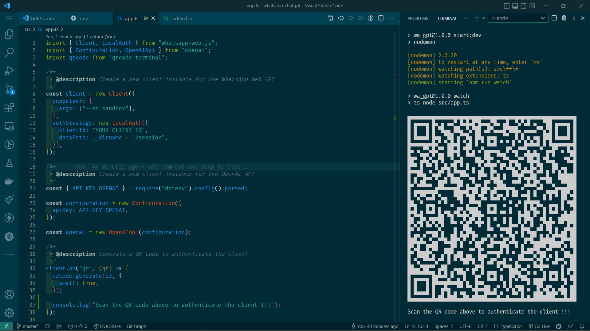

# Simple Integration of the ChatGPT (OpenAI) with WhatsApp

This is a simple integration of the [ChatGPT](https://beta.openai.com/overview) (OpenAI) with WhatsApp. It is based on the [ChatGPT](https://beta.openai.com/overview) (OpenAI) API and the [whatsApp-web.js](https://wwebjs.dev/).

## Installation

1. Clone the repository

```bash
git clone https://github.com/asnur/whatsapp-chatgpt.git
```

2. Install the dependencies

```bash
npm install
```

3. Create a `.env` file and add the following variables

```bash
# OpenAI API Key
API_KEY_OPENAI=YOUR_API_KEY
```

4. Run the application

```bash
#build the application
npm run build

#start the application
npm run start
```

## Demo Application


